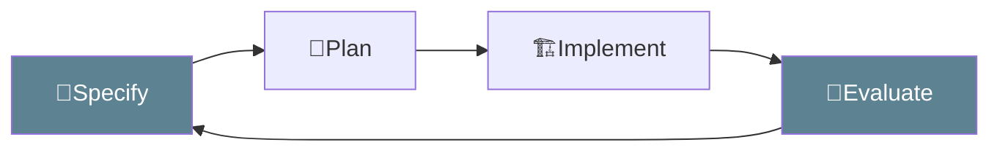

<style>
.cover-title {
  margin-left: auto;
  margin-right: auto;
  width: fit-content;
  text-align: left;
}
.cover-title__word {
  display: block;
  font-size: 5rem;
  line-height: 1.2em;
}
.cover-title__word::first-letter {
  font-weight: bold;
}
</style>
Adaptive
<h1 class="cover-title">
  <span class="cover-title__word"><Keyword>Intent</Keyword></span>
  <span class="cover-title__word">Driven</span>
  <span class="cover-title__word">Development</span>
</h1>

<!--
Oh great.
Another three-letter abbreviation.

But this one is really just an excuse to talk about one word: intent.

Have you ever wondered why developers are still around?
Why do we need developers when the internet already contains more code than any of us can read?
Why do we need developers when agents can generate code faster than we can review it?

My answer is: because code was never the hard part on its own.
The hard part is knowing what the code is supposed to mean.
-->

---
layout: statement
---

# AI generates <Keyword>code</Keyword>
## But is it the __right__ code?

<!--
Welcome to AI Caffeine — behind the hype.
Everyone is talking about AI writing code.
Copilot, Cursor, Devin, agents, workflows, all of it.

And yes, AI can generate code fast.

But fast is not the same as right.
Without context it can generate the wrong code instantly.

The bottleneck was never typing speed.
The bottleneck was always knowing what to build, why it matters, and how we know when it is correct.
-->

---
layout: fact
---

## The missing piece is <Keyword>intent</Keyword>

<!--
This is the gap most teams feel.

We expect the tool to understand our architecture, our conventions, our trade-offs, our history.
But most of that understanding is not written down anywhere the tool can use.

So the output looks plausible, but it misses the point.

The missing piece is intent:
the reason behind the solution,
and the criteria we use to judge whether the solution is right.
-->

---
layout: statement
---

# Development

## __Applied knowledge__ turned into a solution

<Quote author="dictionary.com">
Bring out the capabilities or possibilities<br/>
to a more advanced or effective state.
</Quote>

<!--
A developer's job is not just to know things.
The job is to apply knowledge under constraints.

The same fact can be useless in one context and critical in another.
Development is the act of knowing which knowledge matters here.
-->

---
layout: statement
---

# Intent

## The __goal__ that gives <Keyword>knowledge</Keyword> direction

<Quote author="dictionary.com">
Something that someone is <b>intending</b> or meaning<br/>
to achieve purpose or objective.
</Quote>

---
layout: fact
---

Knowing that 25 indoor laps is 5 km is useful.

<div v-click>

but knowing <Keyword><b>when</b></Keyword> that fact solves the problem is <b><u>development</u></b>

```ts {2,14}
/**
 * Calculate the number of laps required to cover a given distance.
 *
 * @param total_length – distance to cover (e.g. metres)
 * @param lap_length – length of one lap (e.g. 200m indoor, 400m outdoor)
 * @returns number of laps required
 *
 * @example
 * const goal = 5000;
 * calculateNumberOfLaps(goal, 200); // 25 — indoor
 * calculateNumberOfLaps(goal, 400); // 12.5 — outdoor
 */
calculateNumberOfLaps(total_length, lap_length) {
  // Divide the total distance we want to cover by the length of one lap
  const laps = total_length / lap_length;
  return laps;
}
```

</div>

---
layout: statement
---

# If the <Keyword>intent</Keyword> is clear<br/> 
## wrong implementation is a temporary problem
---

# <Keyword><b>Intent</b></Keyword> <u>persists</u>
## Implementation evolves

<style>
.intent-boxes {
  position: relative;
  min-height: 20rem;
}
.intent-box {
  position: absolute;
  inset: 0;
  margin: 0;
}
</style>


<div class="stacked-clicks intent-boxes">

<div class="stacked-click intent-box" v-click v-click.hide="1">

```ts {1,3}
/** explain the intended way to use the implementation */
function fn(...args: number[]): number {
    // explain the intended implementation
}
```
</div>

<div class="stacked-click intent-box" v-click="1" v-click.hide="2">

```ts {2-7,10} 
/**
 * Multiplies all provided numbers.
 *
 * @example
 * const result = product(1, 2, 3); // 6
 *
 * @returns the product of all provided numbers
 */
function product(...args: number[]): number {
    // iterate through all provided args and multiply with each other
}
```

</div>

<div class="stacked-click intent-box" v-click="2" v-click.hide="3">
```ts {11-14}
/**
 * Multiplies all provided numbers.
 *
 * @example
 * const result = product(1, 2, 3); // 6
 *
 * @returns the product of all provided numbers
 */
function product(...args: number[]): number {
    // iterate through all provided args and multiply with each other
    let result = 1;
    for (const value of args) {
        result *= value;
    }
    return result;
}
```
</div>

<div class="stacked-click intent-box" v-click="3" v-click.hide="4">
```ts {11} 
/**
 * Multiplies all provided numbers.
 *
 * @example
 * const result = product(1, 2, 3); // 6
 *
 * @returns the product of all provided numbers
 */
function product(...args: number[]): number {
    // iterate through all provided args and multiply with each other
    const result = args.reduce((cur, next) => cur * next, 1);
    return reuslt
}
```
</div>

<div class="stacked-click intent-box" v-click="4">
```ts {11-12}
/**
 * Multiplies all provided numbers.
 *
 * @example
 * const result = product(1, 2, 3); // 6
 *
 * @returns the product of all provided numbers
 */
function product(...args: number[]): number {
    // iterate through all provided args and multiply with each other
    const [head, ...tail] = args;
    const result = head * product(...tail);
    return result;
}
```
</div>

</div>

---
layout: statement
---

# Shared <Keyword>intent</Keyword>
## becomes engineering __culture__

<!--
When intent is only in one person's head, it is a bottleneck.
When intent is shared, it becomes culture.

Culture is not the poster on the wall.
It is the repeated understanding of how we solve problems here.

That is why intent has to become visible.
If people and agents are going to act on it, they need something to read, test, and correct.
-->

---
layout: full
---

<SlidevVideo autoplay autoreset="slide" playsinline muted id="intent-video">
  <source src="./media/capture-intent.mp4" type="video/mp4" />
</SlidevVideo>

<style>
  #intent-video {
    margin: 0 auto;
    height: 100%;
  }
</style>

<!--
This is what that looks like in practice.
We are not asking the agent to magically know our world.
We are feeding it intent, checking what it does with that intent, and tightening the loop.
-->

---
layout: statement
---

# Specify

## <Keyword><b>What</b></Keyword> and <Keyword><b>why</b></Keyword>

<!--
The first step is specify.
Not "write me some code".
Specify what should exist, why it should exist, and what would make the result acceptable.

This is where we move from wishful prompting to useful intent.
-->

---
layout: statement
---

# Plan

## Steps of <Keyword><b>how</b></Keyword>

<!--
Then we plan.
The plan is not sacred.
It is a bridge between intent and implementation.

It should expose assumptions early, while they are still cheap to change.
-->

---
layout: statement
---

# Implement

## Execution grounded in <Keyword><b>intent</b></Keyword>

<!--
Then we implement.
This is where AI is powerful.
But the implementation is no longer floating freely.
It is grounded in the intent we already made explicit.
-->

---
layout: statement
---

# Evaluate

## Does the <b>output</b> match the <Keyword><b>intent</b></Keyword>?
<br/>
<v-click>

</v-click>

<!--
Evaluation closes the loop.
You're not asking "does the code look right" — you're asking "does it match the intent we wrote down".
If it doesn't, either fix the code — or update the intent if the intent was wrong.
Either way, the artifacts get sharper. The next cycle starts with better intent.
-->

---

# Where does <Keyword>intent</Keyword> live?

<div v-clicks>

- In the rules we repeat
- In the docs we maintain
- In the decisions we preserve

</div>

<!--
So if intent matters, where does it actually live?

Not in one magical document.
Not in a template nobody reads.

It lives in the artifacts we already touch:
the rules we repeat,
the docs we maintain,
and the decisions we preserve.
-->

---

# Conventions

How we want work to be <Keyword>shaped</Keyword>

```md
## Functional style
Prefer functions and composition; avoid classes and imperative mutation.

## Immutability
Never mutate in place; return new data instead.

## map/reduce vs for loops
Prefer `map`, `reduce`, and other array methods over imperative `for` loops.

## TSDoc
Every exported function, type, and module has accurate `@param`, `@returns`, and `@example` where useful.

## Intent comments
Use short internal comments for maintainers that explain *why*, not what the code literally does.
```

<!--
Conventions are intent about style and maintainability.
They tell both developers and agents what "good" looks like in this codebase.
Without this, every generated solution brings its own little worldview with it.
-->

---

# Documentation

What the system is <Keyword>meant</Keyword> to be

```md
# my-app

React app with components and route-based views.

## Get started
`bun install`
`bun run dev`

## Project structure
my-app/
├── src/
│   ├── components/
│   ├── routes/
│   └── App.tsx
├── public/
└── package.json
```

<!--
Documentation is intent about the system.
It says what this thing is meant to be, how it is organized, and how someone should approach it.

Good documentation is not a museum of old facts.
It is operational context for future work.
-->

---

# Architecture Decision Records

Why we chose this <Keyword>path</Keyword>

```md
# 001: Use React for the frontend

## Status
Accepted

## Context
We need a UI framework that supports components and fast iteration.

## Decision
We will use React with TypeScript.

## Consequences
- Strong ecosystem and hiring pool
- Need to manage state (e.g. Zustand)
```

<!--
ADRs are intent about decisions.
They preserve the part that disappears fastest from code: why we chose this path, and what trade-offs came with it.

That is exactly the kind of context an agent cannot infer reliably from the implementation alone.
-->

---
layout: statement
---

## Does this matter in the <Keyword>real</Keyword> world?

<!--
You might be thinking — nice theory, but does this play out in practice?
Let me show you some stories that prove intent is the real asset, not code.
-->

---
layout: statement
---

# Clean Room

<Quote author="Phoenix Technologies, 1984" size="sm">
First, a team studied the IBM BIOS and described everything it did
without using or referencing any actual code.
Then a second team wrote a new BIOS that operated as specified.
</Quote>

<Quote author="Cloudflare 2026" size="sm">
One engineer and an AI model rebuilt the most popular front-end
framework <b>Next</b> from scratch. The whole thing cost about $1,100 in tokens.
</Quote>

<!--
This is not a story about copying IBM.
And it is not really a story about cloning Next.
It is a story about where the value moved.

When the intended behaviour was clear enough,
the implementation became replaceable.

That is the uncomfortable part.
And also the useful part.
-->

---
layout: statement
---

# Implementation is becoming <Keyword>cheap</Keyword>
## Misunderstanding is still __expensive__

<!--
That is the phase-out I would leave you with.

AI makes implementation cheaper.
It does not make misunderstanding cheaper.
In fact, it can make misunderstanding scale faster.

So the important question is not:
can we generate code?

The important question is:
can we express the intent clearly enough that generated code can be evaluated?
-->

---
layout: statement
---

# Our job is not to protect <Keyword>code</Keyword>
## It is to protect __understanding__

<!--
That is why developers are still around.

Not because we are the only ones who can type syntax.
Not because the code we write today is sacred.

We are here to understand the problem,
name the constraints,
make trade-offs explicit,
and leave behind enough intent that the next person,
or the next agent,
can move without guessing.
-->

---
layout: statement
---

# Make the <Keyword>intent</Keyword> clear
## Then let the implementation evolve

<!--
So round it off like this:

If the intent is missing, AI gives us speed in the wrong direction.
If the intent is clear, AI gives us leverage.

That is Adaptive Intent Driven Development.
Specify what matters.
Plan against it.
Implement with help.
Evaluate without mercy.

Because implementation evolves.
Intent is what lets us know whether it evolved in the right direction.

Thank you.
-->